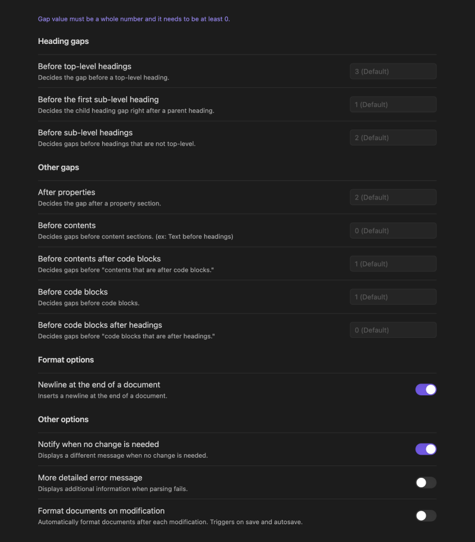

# Formatto
Formatto is a simple Rust-powered markdown formatter plugin for [Obsidian](https://obsidian.md). With user-customizable settings, it was designed to be simple, fast, and easy to use.

    
    

## Contributing
If you're interested in participating in this project, please refer to the [contribution guide](https://github.com/polyecho/formatto/blob/main/CONTRIBUTING.md).

## How to Use
You can use the plugin in following ways:

- Right click in the editor and select "Format Document"
- Run a command "Formatto: Format Document"
- Assign a keyboard shortcut to the command "Formatto: Format Document"
- Click "Format Document" ribbon action